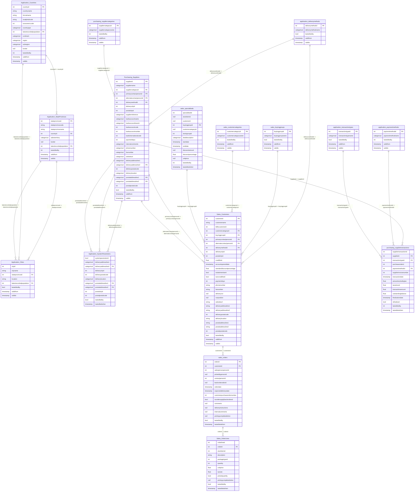

```mermaid
erDiagram
    Application_Cities {
        int cityid
        string cityname
        int stateprovinceid FK
        string location
        int latestrecordedpopulation FK
        bool lasteditedby
        timestamp validfrom
        timestamp validto
    }
    Application_Countries {
        int countryid PK
        string countryname
        string formalname
        string isoalpha3code
        int isonumericcode
        categorical countrytype
        int latestrecordedpopulation PK
        categorical continent
        categorical region
        categorical subregion
        null border
        int lasteditedby
        timestamp validfrom
        timestamp validto
    }
    Application_StateProvinces {
        int stateprovinceid PK
        string stateprovincecode
        string stateprovincename
        int countryid FK
        categorical salesterritory
        null border
        int latestrecordedpopulation PK
        int lasteditedby
        timestamp validfrom
        timestamp validto
    }
    Application_SystemParameters {
        bool systemparameterid
        categorical deliveryaddressline1
        categorical deliveryaddressline2 FK
        int deliverycityid
        int deliverypostalcode
        categorical deliverylocation
        categorical postaladdressline1 FK
        categorical postaladdressline2 FK
        int postalcityid
        int postalpostalcode
        bool lasteditedby
        timestamp lasteditedwhen
    }
    Purchasing_Suppliers {
        int supplierid PK
        categorical suppliername
        int suppliercategoryid FK
        int primarycontactpersonid PK
        int alternatecontactpersonid PK
        int deliverymethodid FK
        int deliverycityid
        int postalcityid
        categorical supplierreference
        categorical bankaccountname
        categorical bankaccountbranch
        int bankaccountcode
        int bankaccountnumber
        int bankinternationalcode
        int paymentdays
        categorical internalcomments
        categorical phonenumber
        categorical faxnumber
        categorical websiteurl
        categorical deliveryaddressline1
        categorical deliveryaddressline2 PK
        int deliverypostalcode
        categorical deliverylocation
        categorical postaladdressline1 PK
        categorical postaladdressline2 PK
        int postalpostalcode
        bool lasteditedby
        timestamp validfrom
        timestamp validto
    }
    Sales_Customers {
        int customerid PK
        string customername
        int billtocustomerid
        int customercategoryid FK
        int buyinggroupid FK
        int primarycontactpersonid FK
        int alternatecontactpersonid FK
        int deliverymethodid FK
        int deliverycityid
        int postalcityid
        float creditlimit
        timestamp accountopeneddate
        float standarddiscountpercentage
        bool isstatementsent
        bool isoncredithold
        int paymentdays
        string phonenumber
        string faxnumber
        null deliveryrun
        null runposition
        string websiteurl
        string deliveryaddressline1
        string deliveryaddressline2
        int deliverypostalcode
        string deliverylocation
        string postaladdressline1
        string postaladdressline2
        int postalpostalcode
        bool lasteditedby
        timestamp validfrom
        timestamp validto
    }
    Sales_OrderLines {
        int orderlineid
        int orderid FK
        int stockitemid
        string description
        int packagetypeid
        int quantity
        float unitprice
        float taxrate
        bool pickedquantity
        null pickingcompletedwhen
        bool lasteditedby
        timestamp lasteditedwhen
    }
    application_deliverymethods {
        int deliverymethodid PK
        categorical deliverymethodname
        bool lasteditedby
        timestamp validfrom
        timestamp validto
    }
    application_paymentmethods {
        int paymentmethodid PK
        categorical paymentmethodname
        int lasteditedby
        timestamp validfrom
        timestamp validto
    }
    application_transactiontypes {
        int transactiontypeid PK
        categorical transactiontypename
        bool lasteditedby
        timestamp validfrom
        timestamp validto
    }
    purchasing_suppliercategories {
        int suppliercategoryid PK
        categorical suppliercategoryname
        int lasteditedby
        timestamp validfrom
        timestamp validto
    }
    purchasing_suppliertransactions {
        int suppliertransactionid
        int supplierid FK
        int transactiontypeid FK
        int purchaseorderid
        int paymentmethodid FK
        int supplierinvoicenumber
        timestamp transactiondate
        float amountexcludingtax
        float taxamount
        float transactionamount
        float outstandingbalance
        timestamp finalizationdate
        bool isfinalized
        int lasteditedby
        timestamp lasteditedwhen
    }
    sales_buyinggroups {
        int buyinggroupid PK
        categorical buyinggroupname
        bool lasteditedby
        timestamp validfrom
        timestamp validto
    }
    sales_customercategories {
        int customercategoryid PK
        categorical customercategoryname
        int lasteditedby
        timestamp validfrom
        timestamp validto
    }
    sales_orders {
        int orderid PK
        int customerid FK
        int salespersonpersonid
        null pickedbypersonid
        int contactpersonid
        null backorderorderid
        timestamp orderdate
        timestamp expecteddeliverydate
        int customerpurchaseordernumber
        bool isundersupplybackordered
        null comments
        null deliveryinstructions
        null internalcomments
        null pickingcompletedwhen
        bool lasteditedby
        timestamp lasteditedwhen
    }
    sales_specialdeals {
        int specialdealid
        null stockitemid
        null customerid
        int buyinggroupid PK
        null customercategoryid
        int stockgroupid
        categorical dealdescription
        timestamp startdate
        timestamp enddate
        null discountamount
        float discountpercentage
        null unitprice
        int lasteditedby
        timestamp lasteditedwhen
    }

    Purchasing_Suppliers ||--o{ purchasing_suppliertransactions : "supplierid -> supplierid"
    application_deliverymethods ||--o{ Purchasing_Suppliers : "deliverymethodid -> deliverymethodid"
    application_deliverymethods ||--o{ Sales_Customers : "deliverymethodid -> deliverymethodid"
    application_paymentmethods ||--o{ purchasing_suppliertransactions : "paymentmethodid -> paymentmethodid"
    application_transactiontypes ||--o{ purchasing_suppliertransactions : "transactiontypeid -> transactiontypeid"
    purchasing_suppliercategories ||--o{ Purchasing_Suppliers : "suppliercategoryid -> suppliercategoryid"
    sales_buyinggroups ||--o{ Sales_Customers : "buyinggroupid -> buyinggroupid"
    sales_customercategories ||--o{ Sales_Customers : "customercategoryid -> customercategoryid"
    sales_specialdeals ||--o{ Sales_Customers : "buyinggroupid -> buyinggroupid"
    Application_Countries ||--o{ Application_StateProvinces : "countryid -> countryid"
    Application_StateProvinces ||--o{ Application_Cities : "stateprovinceid -> stateprovinceid"
    Purchasing_Suppliers ||--o{ Application_SystemParameters : "deliveryaddressline2 -> deliveryaddressline2"
    Purchasing_Suppliers ||--o{ Application_SystemParameters : "postaladdressline1 -> postaladdressline1"
    Purchasing_Suppliers ||--o{ Application_SystemParameters : "postaladdressline2 -> postaladdressline2"
    Sales_Customers ||--o{ sales_orders : "customerid -> customerid"
    sales_orders ||--o{ Sales_OrderLines : "orderid -> orderid"
    Application_Countries ||--o{ Application_Cities : "latestrecordedpopulation -> latestrecordedpopulation"
    Application_StateProvinces ||--o{ Application_Cities : "latestrecordedpopulation -> latestrecordedpopulation"
    Purchasing_Suppliers ||--o{ Sales_Customers : "primarycontactpersonid -> primarycontactpersonid"
    Purchasing_Suppliers ||--o{ Sales_Customers : "alternatecontactpersonid -> alternatecontactpersonid"
```
