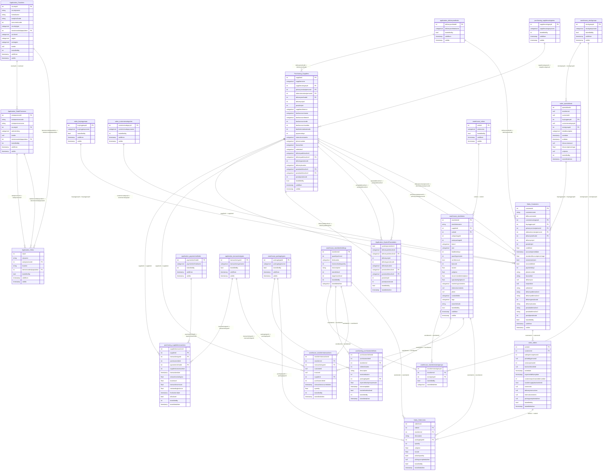

```mermaid
erDiagram
    Application_Cities {
        int cityid
        string cityname
        int stateprovinceid FK
        string location
        int latestrecordedpopulation FK
        bool lasteditedby
        timestamp validfrom
        timestamp validto
    }
    Application_Countries {
        int countryid PK
        string countryname
        string formalname
        string isoalpha3code
        int isonumericcode
        categorical countrytype
        int latestrecordedpopulation PK
        categorical continent
        categorical region
        categorical subregion
        null border
        int lasteditedby
        timestamp validfrom
        timestamp validto
    }
    Application_StateProvinces {
        int stateprovinceid PK
        string stateprovincecode
        string stateprovincename
        int countryid FK
        categorical salesterritory
        null border
        int latestrecordedpopulation PK
        int lasteditedby
        timestamp validfrom
        timestamp validto
    }
    Application_SystemParameters {
        bool systemparameterid
        categorical deliveryaddressline1
        categorical deliveryaddressline2 FK
        int deliverycityid
        int deliverypostalcode
        categorical deliverylocation
        categorical postaladdressline1 FK
        categorical postaladdressline2 FK
        int postalcityid
        int postalpostalcode
        bool lasteditedby
        timestamp lasteditedwhen
    }
    Purchasing_Suppliers {
        int supplierid PK
        categorical suppliername
        int suppliercategoryid FK
        int primarycontactpersonid PK
        int alternatecontactpersonid PK
        int deliverymethodid FK
        int deliverycityid
        int postalcityid
        categorical supplierreference
        categorical bankaccountname
        categorical bankaccountbranch
        int bankaccountcode
        int bankaccountnumber
        int bankinternationalcode
        int paymentdays
        categorical internalcomments
        categorical phonenumber
        categorical faxnumber
        categorical websiteurl
        categorical deliveryaddressline1
        categorical deliveryaddressline2 PK
        int deliverypostalcode
        categorical deliverylocation
        categorical postaladdressline1 PK
        categorical postaladdressline2 PK
        int postalpostalcode
        bool lasteditedby
        timestamp validfrom
        timestamp validto
    }
    Sales_Customers {
        int customerid PK
        string customername
        int billtocustomerid
        int customercategoryid FK
        int buyinggroupid FK
        int primarycontactpersonid FK
        int alternatecontactpersonid FK
        int deliverymethodid FK
        int deliverycityid
        int postalcityid
        float creditlimit
        timestamp accountopeneddate
        float standarddiscountpercentage
        bool isstatementsent
        bool isoncredithold
        int paymentdays
        string phonenumber
        string faxnumber
        null deliveryrun
        null runposition
        string websiteurl
        string deliveryaddressline1
        string deliveryaddressline2
        int deliverypostalcode
        string deliverylocation
        string postaladdressline1
        string postaladdressline2
        int postalpostalcode
        bool lasteditedby
        timestamp validfrom
        timestamp validto
    }
    Sales_OrderLines {
        int orderlineid
        int orderid FK
        int stockitemid FK
        string description
        int packagetypeid FK
        int quantity
        float unitprice
        float taxrate
        bool pickedquantity
        null pickingcompletedwhen
        bool lasteditedby
        timestamp lasteditedwhen
    }
    application_deliverymethods {
        int deliverymethodid PK
        categorical deliverymethodname
        bool lasteditedby
        timestamp validfrom
        timestamp validto
    }
    application_paymentmethods {
        int paymentmethodid PK
        categorical paymentmethodname
        int lasteditedby
        timestamp validfrom
        timestamp validto
    }
    application_transactiontypes {
        int transactiontypeid PK
        categorical transactiontypename
        bool lasteditedby
        timestamp validfrom
        timestamp validto
    }
    purchasing_purchaseorderlines {
        int purchaseorderlineid
        int purchaseorderid
        int stockitemid FK
        int orderedouters
        string description
        int receivedouters
        int packagetypeid FK
        float expectedunitpriceperouter
        timestamp lastreceiptdate
        bool isorderlinefinalized
        int lasteditedby
        timestamp lasteditedwhen
    }
    purchasing_suppliercategories {
        int suppliercategoryid PK
        categorical suppliercategoryname
        int lasteditedby
        timestamp validfrom
        timestamp validto
    }
    purchasing_suppliertransactions {
        int suppliertransactionid
        int supplierid FK
        int transactiontypeid FK
        int purchaseorderid
        int paymentmethodid FK
        int supplierinvoicenumber
        timestamp transactiondate
        float amountexcludingtax
        float taxamount
        float transactionamount
        float outstandingbalance
        timestamp finalizationdate
        bool isfinalized
        int lasteditedby
        timestamp lasteditedwhen
    }
    sales_buyinggroups {
        int buyinggroupid PK
        categorical buyinggroupname
        bool lasteditedby
        timestamp validfrom
        timestamp validto
    }
    sales_customercategories {
        int customercategoryid PK
        categorical customercategoryname
        int lasteditedby
        timestamp validfrom
        timestamp validto
    }
    sales_orders {
        int orderid PK
        int customerid FK
        int salespersonpersonid
        null pickedbypersonid
        int contactpersonid
        null backorderorderid
        timestamp orderdate
        timestamp expecteddeliverydate
        int customerpurchaseordernumber
        bool isundersupplybackordered
        null comments
        null deliveryinstructions
        null internalcomments
        null pickingcompletedwhen
        bool lasteditedby
        timestamp lasteditedwhen
    }
    sales_specialdeals {
        int specialdealid
        null stockitemid
        null customerid
        int buyinggroupid PK
        null customercategoryid
        int stockgroupid FK
        categorical dealdescription
        timestamp startdate
        timestamp enddate
        null discountamount
        float discountpercentage
        null unitprice
        int lasteditedby
        timestamp lasteditedwhen
    }
    warehouse_colors {
        int colorid PK
        categorical colorname
        bool lasteditedby
        timestamp validfrom
        timestamp validto
    }
    warehouse_packagetypes {
        int packagetypeid PK
        categorical packagetypename
        bool lasteditedby
        timestamp validfrom
        timestamp validto
    }
    warehouse_stockgroups {
        int stockgroupid PK
        categorical stockgroupname
        bool lasteditedby
        timestamp validfrom
        timestamp validto
    }
    warehouse_stockitemholdings {
        int stockitemid PK
        int quantityonhand
        categorical binlocation
        int laststocktakequantity
        string lastcostprice
        int reorderlevel
        int targetstocklevel
        int lasteditedby
        categorical lasteditedwhen
    }
    warehouse_stockitems {
        int stockitemid PK
        string stockitemname
        int supplierid FK
        int colorid FK
        int unitpackageid
        int outerpackageid
        categorical brand
        categorical size
        int leadtimedays
        int quantityperouter
        bool ischillerstock
        int barcode
        float taxrate
        float unitprice
        float recommendedretailprice
        float typicalweightperunit
        categorical marketingcomments
        null internalcomments
        null photo
        categorical customfields
        categorical tags
        string searchdetails
        bool lasteditedby
        timestamp validfrom
        timestamp validto
    }
    warehouse_stockitemstockgroups {
        int stockitemstockgroupid
        int stockitemid FK
        int stockgroupid FK
        bool lasteditedby
        categorical lasteditedwhen
    }
    warehouse_stockitemtransactions {
        int stockitemtransactionid
        int stockitemid FK
        int transactiontypeid FK
        null customerid
        null invoiceid
        int supplierid FK
        int purchaseorderid
        timestamp transactionoccurredwhen
        float quantity
        int lasteditedby
        timestamp lasteditedwhen
    }

    Purchasing_Suppliers ||--o{ purchasing_suppliertransactions : "supplierid -> supplierid"
    Purchasing_Suppliers ||--o{ warehouse_stockitems : "supplierid -> supplierid"
    Purchasing_Suppliers ||--o{ warehouse_stockitemtransactions : "supplierid -> supplierid"
    application_deliverymethods ||--o{ Purchasing_Suppliers : "deliverymethodid -> deliverymethodid"
    application_deliverymethods ||--o{ Sales_Customers : "deliverymethodid -> deliverymethodid"
    application_paymentmethods ||--o{ purchasing_suppliertransactions : "paymentmethodid -> paymentmethodid"
    application_transactiontypes ||--o{ purchasing_suppliertransactions : "transactiontypeid -> transactiontypeid"
    purchasing_suppliercategories ||--o{ Purchasing_Suppliers : "suppliercategoryid -> suppliercategoryid"
    sales_buyinggroups ||--o{ Sales_Customers : "buyinggroupid -> buyinggroupid"
    sales_customercategories ||--o{ Sales_Customers : "customercategoryid -> customercategoryid"
    sales_specialdeals ||--o{ Sales_Customers : "buyinggroupid -> buyinggroupid"
    warehouse_packagetypes ||--o{ purchasing_purchaseorderlines : "packagetypeid -> packagetypeid"
    warehouse_packagetypes ||--o{ Sales_OrderLines : "packagetypeid -> packagetypeid"
    warehouse_stockgroups ||--o{ sales_specialdeals : "stockgroupid -> stockgroupid"
    warehouse_stockgroups ||--o{ warehouse_stockitemstockgroups : "stockgroupid -> stockgroupid"
    warehouse_stockitemholdings ||--o{ warehouse_stockitemstockgroups : "stockitemid -> stockitemid"
    warehouse_stockitems ||--o{ warehouse_stockitemstockgroups : "stockitemid -> stockitemid"
    Application_Countries ||--o{ Application_StateProvinces : "countryid -> countryid"
    Application_StateProvinces ||--o{ Application_Cities : "stateprovinceid -> stateprovinceid"
    Purchasing_Suppliers ||--o{ Application_SystemParameters : "deliveryaddressline2 -> deliveryaddressline2"
    Purchasing_Suppliers ||--o{ Application_SystemParameters : "postaladdressline1 -> postaladdressline1"
    Purchasing_Suppliers ||--o{ Application_SystemParameters : "postaladdressline2 -> postaladdressline2"
    Sales_Customers ||--o{ sales_orders : "customerid -> customerid"
    application_transactiontypes ||--o{ warehouse_stockitemtransactions : "transactiontypeid -> transactiontypeid"
    sales_orders ||--o{ Sales_OrderLines : "orderid -> orderid"
    warehouse_colors ||--o{ warehouse_stockitems : "colorid -> colorid"
    warehouse_stockitemholdings ||--o{ purchasing_purchaseorderlines : "stockitemid -> stockitemid"
    warehouse_stockitemholdings ||--o{ warehouse_stockitemtransactions : "stockitemid -> stockitemid"
    warehouse_stockitemholdings ||--o{ Sales_OrderLines : "stockitemid -> stockitemid"
    warehouse_stockitems ||--o{ purchasing_purchaseorderlines : "stockitemid -> stockitemid"
    warehouse_stockitems ||--o{ warehouse_stockitemtransactions : "stockitemid -> stockitemid"
    warehouse_stockitems ||--o{ Sales_OrderLines : "stockitemid -> stockitemid"
    Application_Countries ||--o{ Application_Cities : "latestrecordedpopulation -> latestrecordedpopulation"
    Application_StateProvinces ||--o{ Application_Cities : "latestrecordedpopulation -> latestrecordedpopulation"
    Purchasing_Suppliers ||--o{ Sales_Customers : "primarycontactpersonid -> primarycontactpersonid"
    Purchasing_Suppliers ||--o{ Sales_Customers : "alternatecontactpersonid -> alternatecontactpersonid"
```
